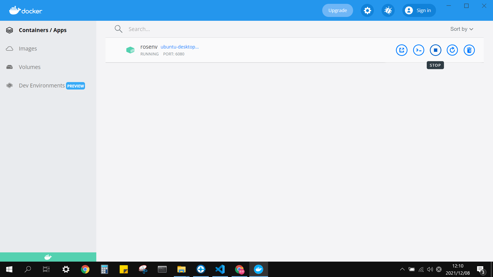

# rosenv

Docker imageにより、ROSの仮想デスクトップ環境を構築します。（Windows10用）

## Quick Start

1. [シュートが作ったロボットマニピュレーションのgithubリポジトリ](https://github.com/shuto1441/robot_manipulation.git)をpullし、本リポジトリをpullしたものと同階層に置く

```
...
  ├─ robot_manipulation
  └─ rosenv
```

2. Dockerを起動した状態で、以下のコマンドからDocker image（仮想環境の作成手順書）をビルドする

```
cd rosenv
build.bat
```

※ "/usr/bin/env: ‘bash\r’: No such file or directory" が出た場合は、noetic/Dockerfile, notetic/ros-noetic-desktop.sh を開き、改行コードをLFに変更してください [[参考](https://qiita.com/ike_pon/items/c677eefa4e6a7a308348)]

3. Imageからコンテナ（仮想環境）を作成し、起動する
```
run.bat {好きなコンテナ名}
```

4. ブラウザからデスクトップにアクセスする（Docker desktopからも可能）
```
http://localhost:6080
```

**※1~3は初回のみ実行**

## Tips

* ポート番号を変更する場合、run.bat内の PORT 変数を編集します。
* 1のディレクトリ構成が異なる場合、run.bat内の VOLUME 変数を編集し、作業ディレクトリ（デフォルトは ../robot_manipulation）の絶対パスを設定します。
* 作成したコンテナの起動と停止は、Docker desktopから操作できます。


## License

このリポジトリには、[Apache License 2.0](https://www.apache.org/licenses/LICENSE-2.0)で配布されている、以下の製作物が含まれています。

* [fcwu/docker-ubuntu-vnc-desktop](https://github.com/fcwu/docker-ubuntu-vnc-desktop.git)
* [Tiryoh/docker-ros-desktop-vnc](https://github.com/Tiryoh/docker-ros-desktop-vnc.git)